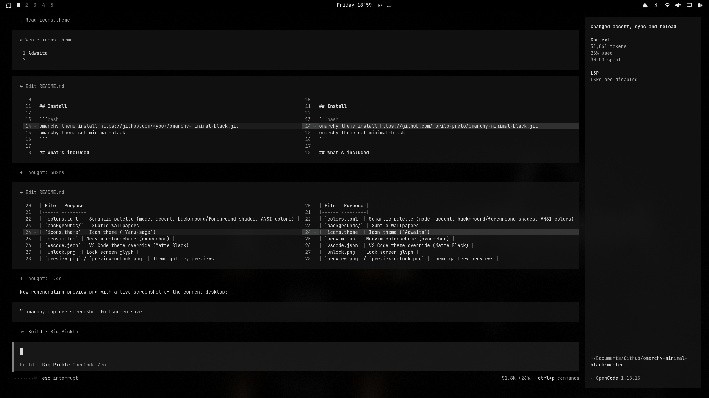

# Minimal Black - Omarchy Theme

A minimalist Omarchy Theme for Omarchy 4 (Quickshell) on Arch Linux / Hyprland.

A dead simple theme for the digital minimalist. Quiet black & white without the loud colors so you can achieve deep focus and deep work. Goes edge-to-edge on your monitor without wasting valuable screen real estate.

Includes a large set of subtle backgrounds. No dramatic backgrounds. No clown-color text. No workspace animations. No nonsense.

Einstein & Jobs wore the same damn thing every day. Now you can too.

## Install

```bash
omarchy theme install https://github.com/<you>/omarchy-minimal-black.git
omarchy theme set minimal-black
```

## What's included

| File | Purpose |
|------|---------|
| `colors.toml` | Semantic palette (mode, accent, background/foreground shades, ANSI colors) |
| `backgrounds/` | Subtle wallpapers |
| `icons.theme` | Icon theme (`Yaru-sage`) |
| `neovim.lua` | Neovim colorscheme (oxocarbon) |
| `vscode.json` | VS Code theme override (Matte Black) |
| `unlock.png` | Lock screen glyph |
| `preview.png` / `preview-unlock.png` | Theme gallery previews |

## Notes

- All other configs (terminals, hyprland, shell, btop, etc.) are generated
  from `colors.toml` by Omarchy's template engine at theme-set time.
- The terminal palette keeps the original monochrome ANSI look; UI selection
  fills are subtle gray while terminal selections stay high-contrast inverted
  (white on black).
- Personal tweaks (terminal opacity, gaps) belong in your own
  `~/.config/` files, not the theme.


