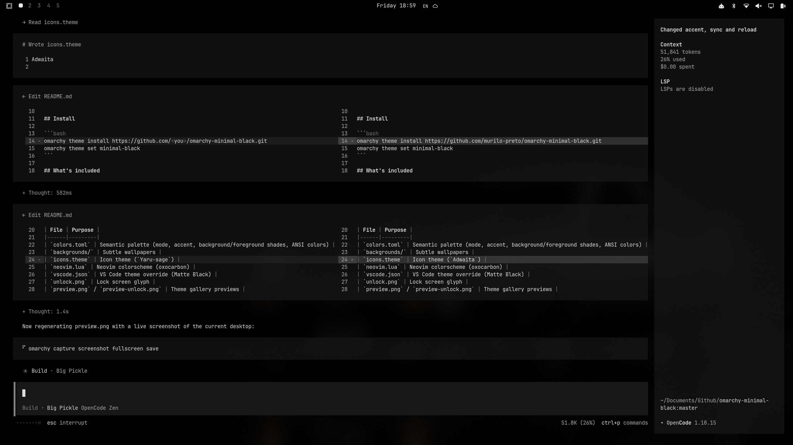

# Minimal Black - Omarchy Theme

A minimalist Omarchy Theme for Omarchy 4 (Quickshell) on Arch Linux / Hyprland.

A dead simple theme for the digital minimalist. Quiet black & white without the loud colors so you can achieve deep focus and deep work. Goes edge-to-edge on your monitor without wasting valuable screen real estate.

Includes a large set of subtle backgrounds. No dramatic backgrounds. No clown-color text. No workspace animations. No nonsense.

Einstein & Jobs wore the same damn thing every day. Now you can too.

## Install

```bash
omarchy theme install https://github.com/murilo-preto/omarchy-minimal-black.git
omarchy theme set minimal-black
```

## What's included

| File | Purpose |
|------|---------|
| `colors.toml` | Semantic palette (mode, accent, background/foreground shades, ANSI colors) |
| `hyprland.lua` | Theme-only Hyprland overrides (blur, shadow, rounding, window opacity, hairline borders, shell layer blur) |
| `shell.toml` | Translucent Omarchy shell surfaces: bar, menus, launcher, notifications, popups, lock card |
| `alacritty.toml` | Terminal palette + `[window] opacity` (terminal background alpha) |
| `backgrounds/` | Subtle wallpapers |
| `icons.theme` | Icon theme (`Adwaita`) |
| `neovim.lua` | Neovim colorscheme (oxocarbon) |
| `vscode.json` | VS Code theme override (Matte Black) |
| `unlock.png` | Lock screen glyph |
| `preview.png` / `preview-unlock.png` | Theme gallery previews |

## Transparency and blur

Omarchy will not stage `*.lua` or a terminal config from a theme installed with
`omarchy theme install` -- those files run code, and a cloned theme comes from a
stranger. It drops them and prints what it ignored on stderr.

So `hyprland.lua` and `alacritty.toml` here take effect only when the theme
directory is one you wrote yourself, or a symlink to your own working copy:

```bash
git clone https://github.com/murilo-preto/omarchy-minimal-black.git ~/Projects/omarchy-minimal-black
ln -s ~/Projects/omarchy-minimal-black ~/.config/omarchy/themes/minimal-black
omarchy theme set minimal-black
```

**Installed the normal way instead?** Put the blur and window opacity in your
own `~/.config/hypr/looknfeel.lua`, and `opacity = 0.85` under `[window]` in
`~/.config/alacritty/alacritty.toml`. Both apply to every theme, not just this
one.

The two alphas compound: Alacritty's `0.85` covers its background, the Hyprland
rule's `0.94` the whole window, so the terminal background lands near `0.80`
while text stays at `0.94`. `blur.ignore_opacity = true` is what makes the blur
reach behind the terminal's own alpha.

The window opacity rule is scoped to Omarchy's `default-opacity` tag, so apps
that opt out -- steam, qemu, video web apps, picture-in-picture -- stay opaque.

Edge-to-edge (`gaps_in`/`gaps_out`/`border_size = 0`) is commented out in
`hyprland.lua`; uncomment for the full minimal look.

## Glass shell

`shell.toml` lowers the background alpha of the bar, launcher, menus,
notifications, popups, tooltips, polkit prompt and lock card, and swaps their
borders for a faint white hairline. `hyprland.lua` adds a layer rule that blurs
what sits behind those surfaces, plus a soft window shadow and 1px translucent
window borders.

`shell.toml` is kept by `omarchy theme install`, so translucency works for
everyone; the blur behind it needs `hyprland.lua`, i.e. the symlinked setup
above. Without blur, lower alphas just look see-through rather than frosted.

The layer rule's `ignore_alpha = 0.4` sits between the full-screen scrims
(<= 0.30) and the cards (>= 0.55), so opening a menu blurs only behind the
card, not the whole screen. Keep that ordering if you tune the alphas.

## Notes

- `shell.toml` is a hand-resolved copy of Omarchy's `shell.toml.tpl`; its
  colors must also be kept in sync with `colors.toml`.
- Every other config (shell, btop, neovim, helix, etc.) is generated from
  `colors.toml` by Omarchy's template engine at theme-set time.
- Shipping `alacritty.toml` means Omarchy's `alacritty.toml.tpl` is skipped for
  this theme, so its palette is a manual copy of `colors.toml` -- keep the two
  in sync.
- The terminal palette keeps the original monochrome ANSI look; UI selection
  fills are subtle gray while terminal selections stay high-contrast inverted
  (white on black).


